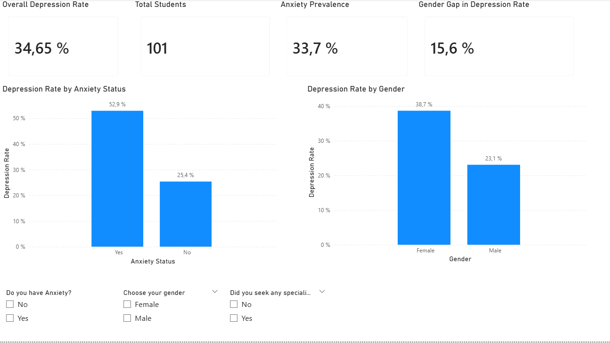

# Mental Health Analysis in University Students

## Project Overview

This project explores the relationship between anxiety and depression in university students through data analysis.

The main objective is to measure prevalence rates, compare groups by gender, and identify potential high-risk populations within the sample.

---

## Dashboard

---

## Dataset Description

The dataset contains survey responses from university students.

Each row represents an individual student and includes the following variables:

- Gender
- Depression (Yes/No)
- Anxiety (Yes/No)
- Sought Professional Treatment (Yes/No)

The data was structured for analytical purposes and prepared for relational querying and visualization.

---

## Tools Used

- Microsoft Excel — Data cleaning and preprocessing  
- SQL — Data exploration, filtering, and metric calculation  
- Power BI — Data modeling and interactive dashboard visualization  

---

## Analytical Process

1. Cleaned and standardized categorical variables in Excel.
2. Imported the dataset into SQL for exploratory analysis and prevalence calculations.
3. Created queries to measure depression rates across gender and anxiety groups.
4. Built an interactive Power BI dashboard to visualize key metrics and trends.
5. Interpreted results to identify patterns and potential risk segments.

---

## Key Findings

- 34.65% of students in the sample present depression.
- Students with anxiety show a significantly higher prevalence of depression.
- Female students show a higher percentage of depression compared to male students.
- Students who sought professional treatment all belonged to the depression group (this does not imply causation).

---

## Business Insight

The analysis suggests that anxiety is a strong indicator associated with depression within the student population.

Identifying students experiencing anxiety could help universities prioritize early mental health interventions and support programs.

---

## Conclusion

The analysis reveals a strong association between anxiety and depression among university students, with noticeable differences by gender.

These findings highlight the importance of early detection strategies and targeted mental health support programs within academic institutions.

---

## Repository Files

This repository contains the following files:

- students_mental_health.csv → Dataset used for the analysis.
- mental_health_dashboard.pbix → Power BI dashboard file.
- mental_health_dashboard.png → Screenshot of the final dashboard visualization.

To explore the dashboard interactively, download the .pbix file and open it using Microsoft Power BI Desktop.
